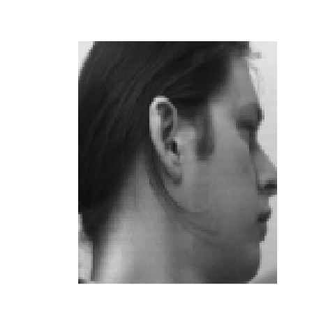

In this document, we reproduce a result as seen in Wang (2011). 
By using dimensionality reduction technique (diffusion map in particular), we recover the chronological order of the face images. The data we have are 36 face images each of which is of resolution about 112 x 92 pixels. 


## Load and process data
```{r, message = F, fig.width = 7, fig.height = 7, warning = FALSE, results = 'hide'}
rm(list = ls())
library(maniTools)
util_path <- system.file("face_ordering", "util_face_ordering.R", package = "maniTools")
source(util_path)

# load and process data
path <- system.file("face_ordering//umist_cropped//1a//face//", package = "maniTools")
image_files <- load_files(path)   #don't worry about the warnings.
image_matrix <- convert_files_to_matrix(image_files)
my_data <- purrr::map(image_matrix, as.vector) %>% do.call(rbind, .)

# create GIF in the true order
animation::saveGIF({
  purrr::walk(seq_along(image_files), ~plot(image_files[[.]]))
}, movie.name = "true_order.gif", interval = 0.1)
```


## Shuffle the images
```{r, message = F, fig.width = 7, fig.height = 7, warning = FALSE, results = 'hide'}
# mix up the order. it actually makes no differences to the DR technique, 
# but let's do it to set one's mind at ease.
random_shuffle <- sample(seq_along(image_files))  #shuffles the order
image_files <- image_files[random_shuffle]
image_matrix <- image_matrix[random_shuffle]
my_data <- my_data[random_shuffle, ]  

# create GIF in the random order
animation::saveGIF({
  purrr::walk(seq_along(image_files), ~plot(image_files[[.]]))
}, movie.name = "random_order.gif", interval = 0.1)
```


## Perform dimensionality reduction using diffusion map
```{r, message = F, fig.width = 7, fig.height = 7, warning = FALSE}
# perform dimensionality reduction
proj_data <- diffusionMap::diffuse(dist(my_data), neigen = 1)$X
```


## Results
```{r, message = F, fig.width = 7, fig.height = 4, warning = FALSE}
#plot results
proj_data <- cbind(x = proj_data, y = 0)
plot(proj_data)
purrr::walk(seq_along(image_files), ~plot_faces(., proj_data, image_matrix, 0.35, 0.35))
```

```{r, message = F, fig.width = 4, fig.height = 4, results = 'hide'}
# create GIF in the reconstructed order
animation::saveGIF({
  purrr::walk(order(proj_data[,1]), ~plot(image_files[[.]]))
}, movie.name = "reconstructed_order.gif", interval = 0.1)  
```

The following three GIF files correspond to the: True order, Randomly shuffled order and Reconstructed order respectively. 




In the above, we recovered (almost perfectly) the chronological order of the face images with diffusion map!


## Reference
Paper:  
1. Wang, J. (2011). Geometric structure of high-dimensional data and dimensionality reduction (pp. 294). Springer Berlin Heidelberg.

Data:  
1. http://www.visioneng.org.uk/datasets/  
2. Graham, Daniel B. and Allinson, Nigel (1998) Face database. [Dataset] at http://eprints.lincoln.ac.uk/16081/  
(Permission acquired from Prof. Nigel Allinson at nallinson@lincoln.ac.uk on 16 May, 2016.)
